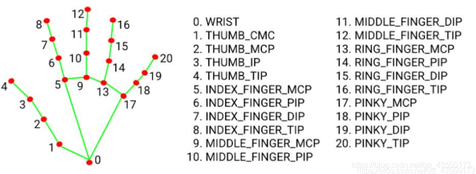
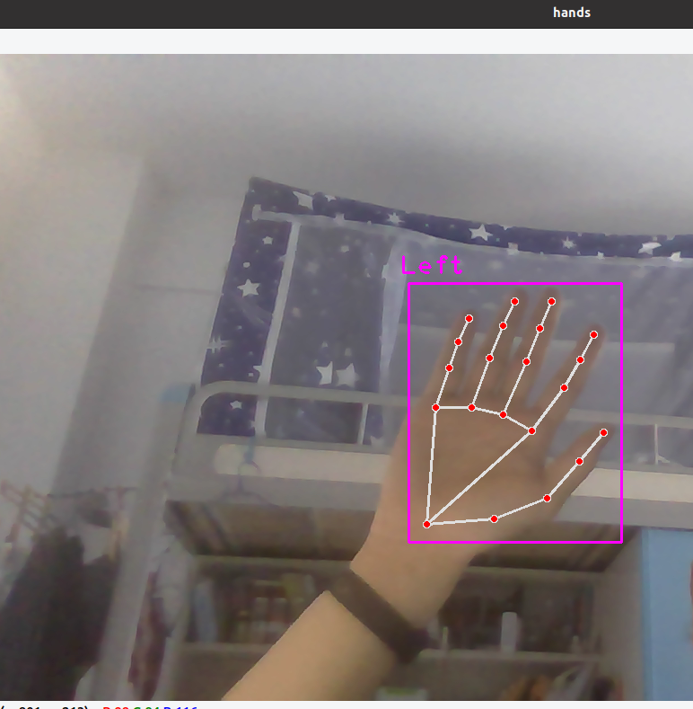

# Gestures2Operation

It's our Computer Graphics final project. 

We want to convert gestures(from camera) to keyboard operation. 

Hello world!

### Mediapipe

Our detection part is made in use of `madiapipe`, a frame work to dect human working of google.

Its data is like this.(the data: hand).

```python
[
    {'lmList': [[478, 523, 0],      #[x, y, z]
                [553, 517, -17], 
                [612, 494, -17], 
                [648, 453, -17], 
                [675, 421, -17], 
                [595, 419, 12], 
                [631, 371, 5], 
                [649, 340, -4], 
                [664, 312, -12], 
                [563, 401, 12], 
                [589, 342, 7], 
                [604, 305, -6], 
                [617, 275, -16], 
                [528, 393, 9], 
                [548, 338, 0], 
                [563, 302, -11],
                [576, 275, -19], 
                [488, 393, 3], 
                [503, 349, -6], 
                [513, 320, -12], 
                [525, 294, -15]
               ], 
     'bbox': (478, 275, 197, 248), 
     'center': (576, 399), 
     'type': 'Left'
    }
]
```


​	And its map is (in the 'lmList:'), where its axis is [x,y,z], and x is left to right; y is up to the down, and z is inside screen out.





### TODO:

1. give a compact GUI interaction for  games, presentations, 3d interaction, desktop control, etc.

1. Train the data from finger into gesture recongnition, with utility of mathematical knowledges like discrete curvature.(离散曲率).
